# 🌍 Travel Guide

A full-stack travel discovery web application built with **PHP** and **MySQL**. Browse countries, explore detailed places, read travel blogs, and pick up practical travel tips — all through a responsive, light/dark themed interface with a dedicated admin panel behind it.


 
---

## 📖 About

Travel Guide centralizes country and place information — history, best time to visit, entry fees, map links — alongside a travel blog and tips section, so users don't need five different sites to plan a trip. Built as a group project by a 5-person team, each owning a distinct module.

## ✨ Features

**Visitor**
- Browse countries with search, and drill into detailed country pages
- Explore places by category and rating, with full detail pages (history, entry fee, best time to visit, Google Maps link)
- View top-rated places sorted by rating
- Save favourite places to a personal list
- Read travel blog posts and full articles
- Browse practical travel tips by category
- Register, log in/out, and manage a personal profile
- Light / dark theme toggle site-wide

**Admin**
- Secure admin login
- Dashboard overview of site content
- Add & manage countries, places, blog posts, and tips
- Dedicated admin sidebar navigation

---

## 🖼️ Screenshots

### 🎬 Interactive Animations
<table>
  <tr>
    <td><b>Homepage Loop Preview</b></td>
    <td><b>Place Details Loop Preview</b></td>
  </tr>
  <tr>
    <td>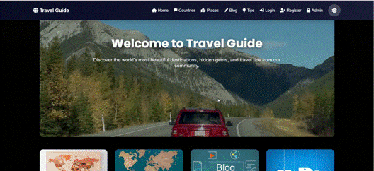</td>
    <td>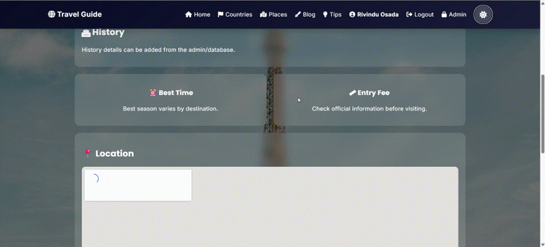</td>
  </tr>
</table>

### 👤 Authentication & Profiles
<table>
  <tr>
    <td><b>Light Mode</b></td>
    <td><b>Dark Mode</b></td>
  </tr>
  <tr>
    <td>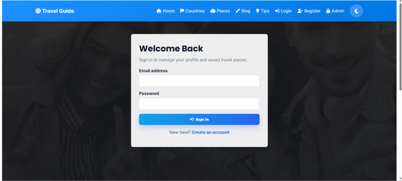</td>
    <td>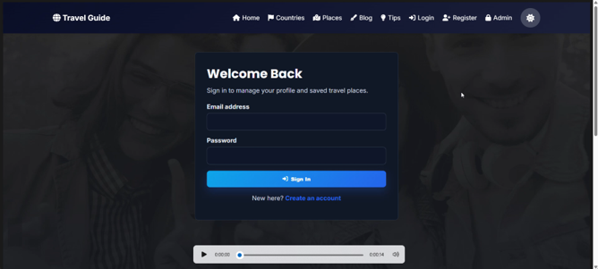</td>
  </tr>
  <tr>
    <td>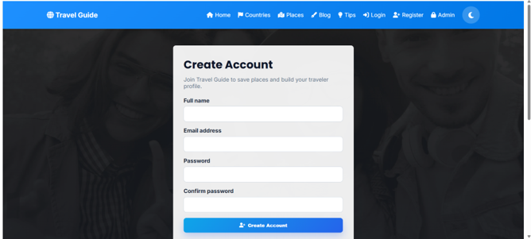</td>
    <td>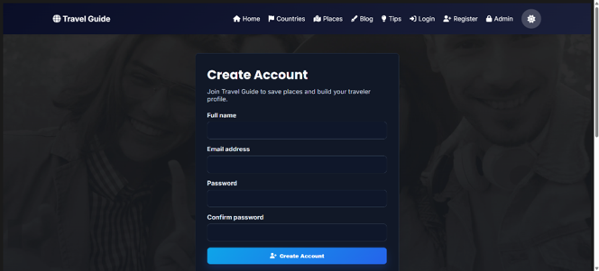</td>
  </tr>
  <tr>
    <td>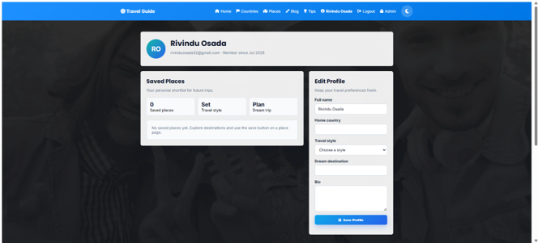</td>
    <td>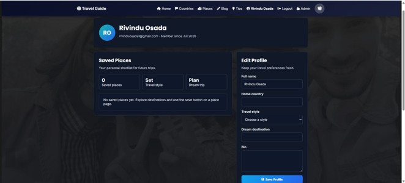</td>
  </tr>
</table>

### 🗺️ Main Application Views
<table>
  <tr>
    <td><b>Light Mode</b></td>
    <td><b>Dark Mode</b></td>
  </tr>
  <tr>
    <td>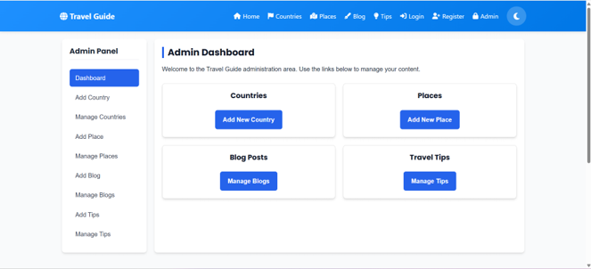</td>
    <td>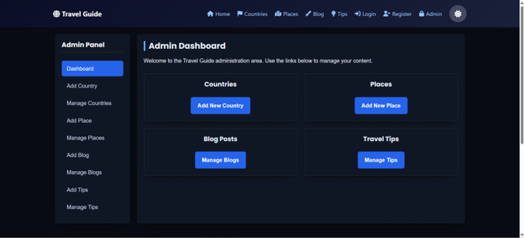</td>
  </tr>
  <tr>
    <td>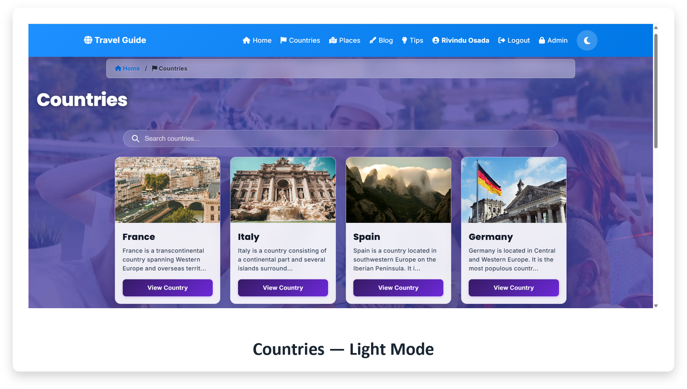</td>
    <td>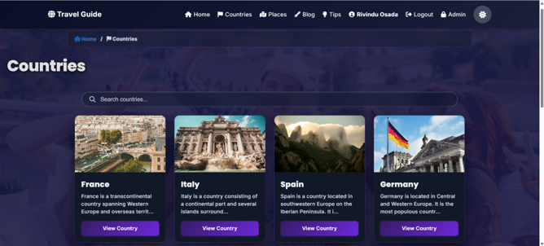</td>
  </tr>
  <tr>
    <td>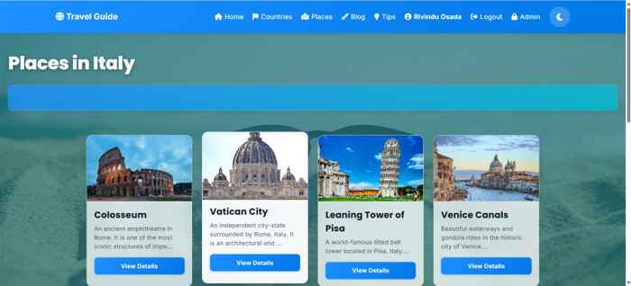</td>
    <td>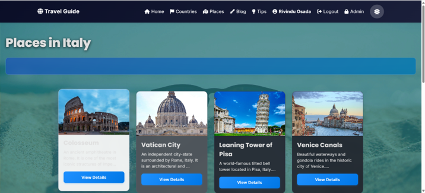</td>
  </tr>
  <tr>
    <td>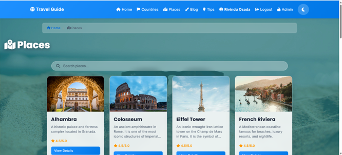</td>
    <td>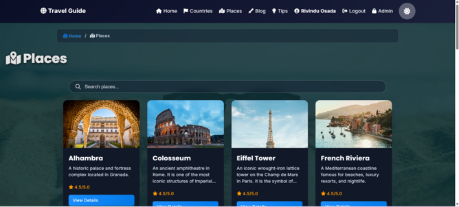</td>
  </tr>
  <tr>
    <td>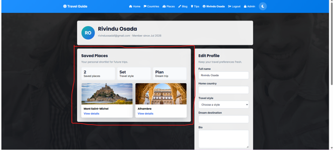</td>
    <td>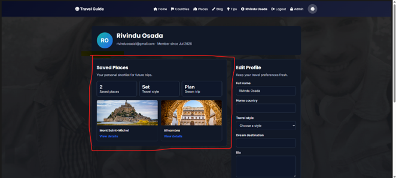</td>
  </tr>
  <tr>
    <td>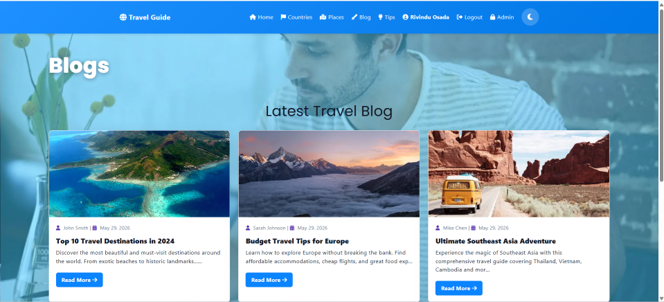</td>
    <td>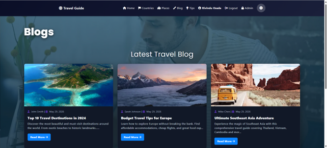</td>
  </tr>
  <tr>
    <td>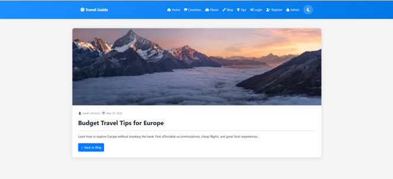</td>
    <td>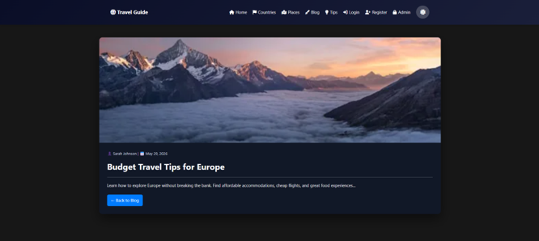</td>
  </tr>
  <tr>
    <td>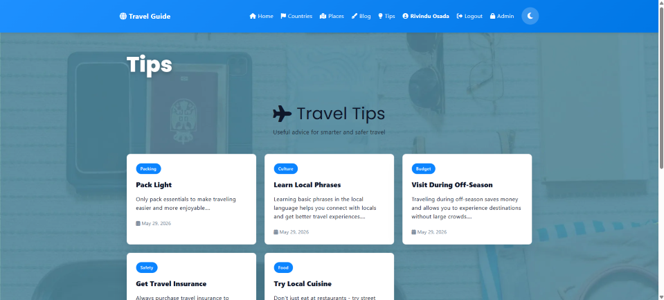</td>
    <td>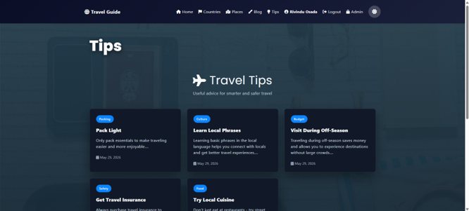</td>
  </tr>
</table>

### 🛠️ Admin Panel System
<table>
  <tr>
    <td><b>Light Mode</b></td>
    <td><b>Dark Mode</b></td>
  </tr>
  <tr>
    <td>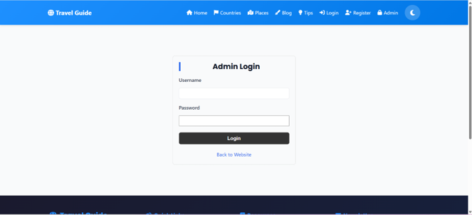</td>
    <td>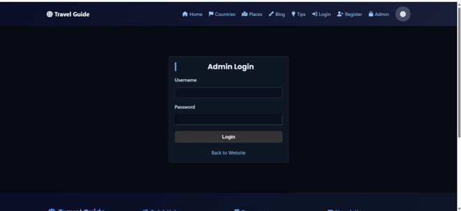</td>
  </tr>
  <tr>
    <td>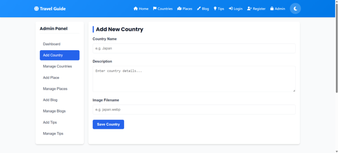</td>
    <td>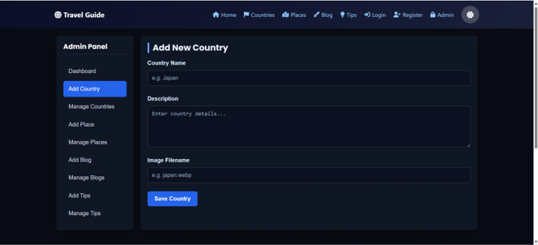</td>
  </tr>
  <tr>
    <td>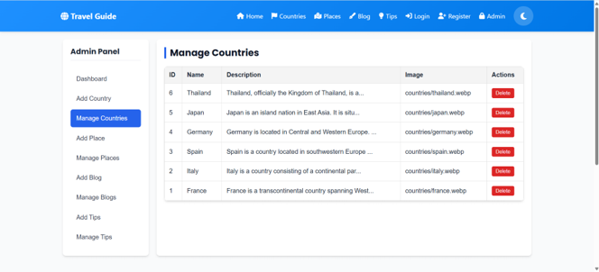</td>
    <td>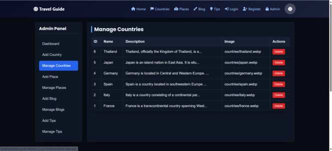</td>
  </tr>
  <tr>
    <td>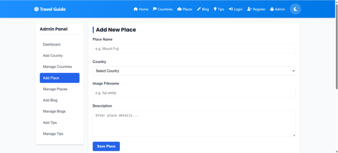</td>
    <td>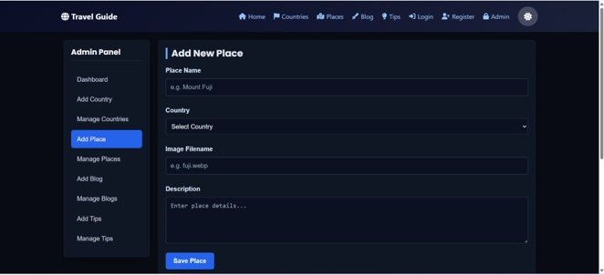</td>
  </tr>
  <tr>
    <td>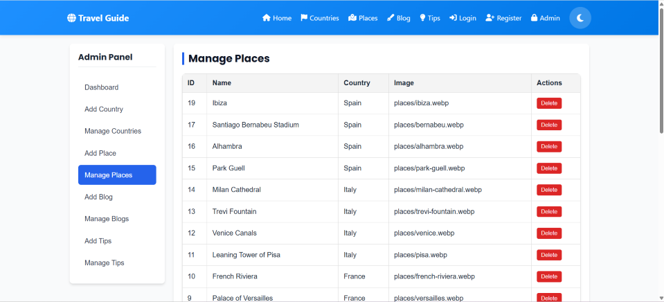</td>
    <td>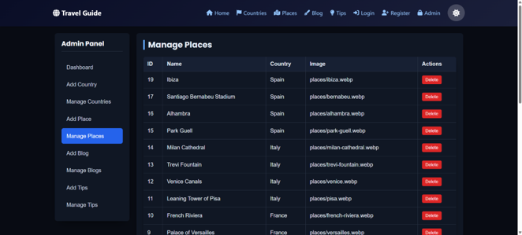</td>
  </tr>
  <tr>
    <td>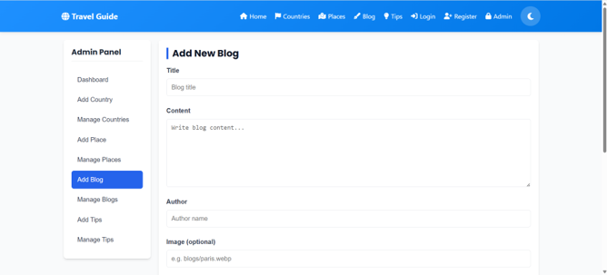</td>
    <td>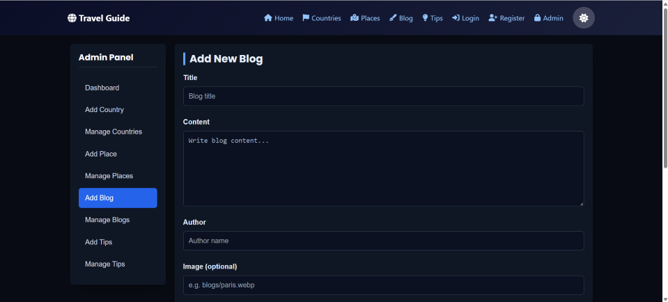</td>
  </tr>
  <tr>
    <td>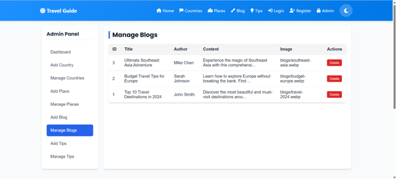</td>
    <td>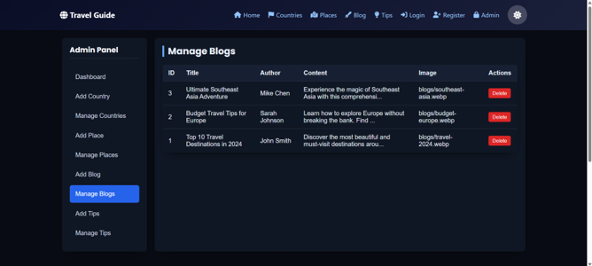</td>
  </tr>
  <tr>
    <td>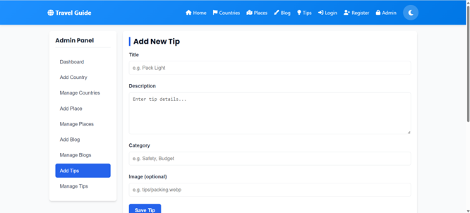</td>
    <td>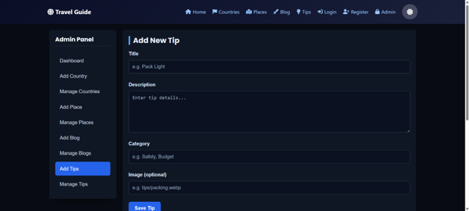</td>
  </tr>
  <tr>
    <td></td>
    <td>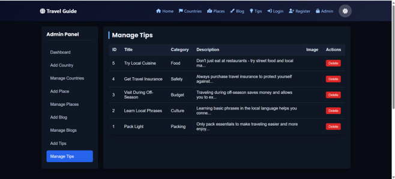</td>
  </tr>
</table>

---

## 🗄️ Database Schema (ER Diagram)

<!-- Add ER diagram image here, e.g. docs/er-diagram.png -->

**Tables:** `countries`, `places`, `place_details`, `blog`, `tips`, `users`, `saved_places`, `admins`

See [`database-setup.sql`](./database-setup.sql) for the full schema and sample data.

---

## 🛠️ Tech Stack

| Layer | Technology |
|---|---|
| **Backend** | PHP (mysqli, prepared statements) |
| **Database** | MySQL |
| **Frontend** | HTML5, CSS3, JavaScript |
| **Styling** | Custom CSS (`style.css`, `admin.css`, `blog.css`, `account.css`, `responsive.css`), Bootstrap 5 (blog pages) |
| **Tooling** | MySQL Workbench, phpMyAdmin |

---

## 🚀 Getting Started

### Prerequisites
- PHP 7.4+ with the `mysqli` extension
- MySQL 5.7+ (or MariaDB equivalent)
- A local server stack (XAMPP, WAMP, MAMP) or the PHP built-in server

### Setup

1. **Clone the repo**
   ```bash
   git clone https://github.com<your-username>/travel-guide.git
   cd travel-guide
   ```

2. **Import the database**
   - Open MySQL Workbench or phpMyAdmin.
   - Create a database named `travel_guide`.
   - Run the [`database-setup.sql`](./database-setup.sql) script file to configure schema structures and seed initial sample tables.

3. **Configure your database connection**
   - Copy the example configuration schema:
     ```bash
     cp includes/config.example.php includes/db.php
     ```
   - Open and edit your local environment credentials inside `includes/db.php`:
     ```php
     \$host = "localhost";
     \$port = 3306;
     \$user = "root";
     \$password = "your_password";
     \$database = "travel_guide";
     ```
   - ⚠️ Note: `db.php` is explicitly set within `.gitignore` — never commit operational environment parameters online.

4. **Run the app**
   ```bash
   php -S localhost:8000
   ```
   Visit `http://localhost:8000` inside your web browser.

5. **Verify the connection**
   Navigate to `http://localhost:8000/test.php` — it will print `Database Connected Successfully!` once configuration settings are verified.

---

## 📁 Project Structure

```text
travel-guide/
├── admin/
│   ├── add-country.php
│   ├── add-place.php
│   ├── admin-dashboard.php
│   ├── admin-login.php
│   ├── admin-sidebar.php
│   ├── admin-signup.php
│   ├── blog-add.php
│   ├── blog-manage.php
│   ├── manage-countries.php
│   ├── manage-places.php
│   ├── tips-add.php
│   └── tips-manage.php
├── assets/
│   ├── css/
│   │   ├── account.css
│   │   ├── admin.css
│   │   ├── blog.css
│   │   └── style.css
│   ├── images/
│   │   ├── backgrounds/
│   │   ├── blogs/
│   │   ├── countries/
│   │   ├── icons/
│   │   └── places/
│   ├── js/
│   │   ├── app-ui.js
│   │   └── search.js
│   └── videos/
│       └── travel-hero.mp4
├── includes/
│   ├── auth.php
│   ├── config.php
│   ├── db.php
│   ├── footer.php
│   └── navbar.php
├── sql/
│   ├── database-setup.sql
│   └── railway-setup.sql
├── Screenshots/
├── .gitattributes
├── blog-details.php
├── blog.php
├── countries.php
├── country-view.php
├── index.php
├── login.php
├── logout.php
├── place-details.php
├── places.php
├── profile.php
├── register.php
├── save-place.php
├── tips.php
├── top-places.php
└── README.md
```

## 👥 Team & Contributions
 
| Member | Contribution |
|---|---|
| **Rivindu Osada** | Project idea & database design, `index.php`, save places, login/logout & auth, countries & country view, profile & register, `config.php`/`db.php`, footer, navbar, `app-ui.js`, `account.css`, `style.css` |
| **Tharushika** | Top Places page, Places listing page |
| **Vimuth** | Full admin panel & sidebar, admin login, add/manage country, place, blog, tips, admin dashboard |
| **Heshan** | Blog page, Tips page, `blog.css` |
| **Vishva** | Place Details page, `search.js` |
 
## 🗺️ Roadmap
 
- [ ] Move admin passwords from plaintext to hashed storage
- [ ] Add CSRF protection and input sanitization audit
- [ ] Deploy to public hosting with live demo link
- [ ] Add `file_exists` checks before all image renders
- [ ] Expand test coverage for admin CRUD flows
## 📄 License
 
This project was built for academic purposes. Feel free to fork and adapt for learning.
 
---
 
Built by Rivindu Osada, Tharushika, Vimuth, Heshan & Vishva.
 


